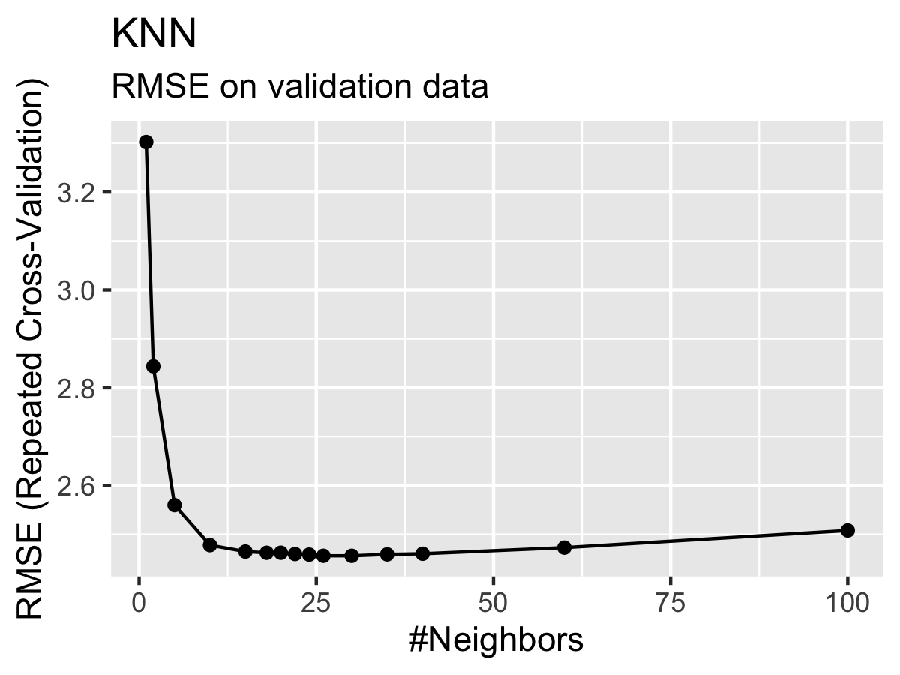

# Model training {#training}

Model training in supervised ML is guided by the match (or mismatch) between the predicted and observed target variable(s), that is, between $\hat{Y}$ and $Y$. The *loss* function quantifies this mismatch ($L(\hat{Y}, Y)$), and the algorithm takes care of progressively reducing the loss during model training. Let's say the ML model contains two parameters and predictions can be considered a function of the two ($\hat{Y}(w_1, w_2)$). $Y$ is actually constant. Thus, the loss function is effectively a function $L(w_1, w_2)$. Therefore, we can consider the model training as a search of the parameter space of the machine learning model $(w_1, w_2)$ to find the minimum of the loss. Common loss functions are the root mean square error (RMSE), or the mean square error, or the mean absolute error.

```{r, echo = FALSE, fig.cap = "Visualization of a loss function as a plane spanned by the two parameters $w_1$ and $w_2$."}
knitr::include_graphics("./fig/loss_plane.png")
```

Loss minimization is a general feature of ML model training. Practically all ML algorithms have some "knobs" to turn in order to achieve efficient model training and predictive performance. What these knobs are, depends on the ML algorithm.

In Video 6B you learned how the loss minimization, at least for some ML methods (e.g., artificial neural networks), is guided by *gradient descent*. It offers a principle for determining in what direction to jump and search the parameter space. *Gradient descent* changes parameters relative to a reference such that for a given "distance" of the "jump", the loss is reduced by as much as possible. In other words, it descends along the steepest gradient of the loss hyperplane (the yellow-red plane in the figure above). You can imagine this as the trajectory of a ball rolling into the loss "depression".

Model training is implemented in R for different algorithms in different packages. Some algorithms are even implemented by multiple packages (e.g., `nnet` and `neuralnet` for artificial neural networks). As described in Chapter \@ref(ch-06), the **caret** package provides "wrappers" that handle a large selection of different ML model implementations in different packages with a unified interface (see [here](https://topepo.github.io/caret/available-models.html) for an overview of available models). The **caret** function `train()` is the centre piece. Its argument `metric` specifies the loss function and defaults to RMSE for regression models and accuracy for classification (see sub-section on metrics below). A complete implementation of model training with caret is demonstrated further below.

## Hyperparameter tuning

As for practically all ML algorithms, there are free parameters that determine their characteristics and how the learning operates - *hyperparameters*. Turning back to the analogue of the ball and the loss depression, imagine the effect of how fast the ball mentioned before is rolling. If it rolls too fast (that is if the "jump" of the parameter search is too large), it descends into the depression fast but may shoot beyond the minimum and it has to do a "180-degrees turn" and continue the search. That's not very efficient. On the other extreme, a very slowly rolling ball (the parameter space is searched with small jumps) will take much longer to arrive at the bottom of the depression. Hence, there is an optimum in between. This "size of the jump" is called the *learning rate*, and it usually has to be tuned for optimal performance of model training of artificial neural networks. Other ML algorithms have other types of hyperparameters. While some hyperparameters determine the performance of the model training, other hyperparameters are decisive for the model's predictive skills. Hyperparameters are not to be confused with the model coefficients. For example, in linear regression, the number of predictors can be considered a hyperparameter, while the values of $\beta$ are the coefficients. In general, hyperparameters determine the *structure* of the algorithm.

Let's turn to the K-nearest neighbour (KNN) algorithm as an example. In KNN, the hyperparameter is $k$. That is, the number of neighbours to consider taking their mean. With KNN, there is always an optimum $k$. Obviously, if $k = n$, we consider all observations as neighbours and each prediction is simply the mean of all observed target values $Y$, irrespective of the predictor values. This cannot be optimal and such a model will likely underfit. On the other extreme, with $k = 1$, the model will be strongly affected by the noise in the single nearest neighbour and its generalisability will suffer. This should be reflected in a poor performance on the validation data. Indeed, it is, as the Figure \@ref(fig:hyper) illustrates.

```{r hyper, echo = FALSE, fig.cap = "Improvement in RMSE on validation data with increasing number of neighbours."}

```

You will encounter different hyperparameters for neural networks in later chapters.

In **caret**, hyperparameter tuning is implemented as part of the `train()` function. Values of hyperparameters to consider are to be specified by the argument `tuneGrid`, which takes a data frame with column(s) named according to the name(s) of the hyperparameter(s) and rows for each combination of hyperparameters to consider. More explicit examples follow below.

## Resampling

At the beginning of this tutorial, we demonstrated a case of overfitting. In the example with KNN above, the increasing error on the validation data (measured by RMSE) is an indication of poor *generalisability*. The goal of model training is to achieve the best possible generalisation performance. That is, the lowest validation error measured by applying the trained model on the testing data set from the initial split. Note the distinction: validation data is what is used during model training, testing data is held out at the initial split and not used during model training.

But how can the generalisability be assessed when the testing set is held out completely during the training step? To measure the model's generalisability and "direct" the ML algorithm to minimize the validation error during the training step, we can further split the training set into one or more training and validation sub-set. This is called *resampling*. The model performance determined on this resampled validation set is then a good estimate of the generalisation error we get when evaluated against the testing data that was set aside from the initial split.

The challenge to be met here is that we further reduce the number of data points in the resampled training and validation sets which may lead to evaluation statistics not being sufficiently robust and bears the potential that we're training to some peculiarities in the (relatively small) validation set. In order to control for this, common practice is to do multiple resamples (multiple *folds* of training-validation splits) which is the *repeat* part of repeated CV.

By repeating cross-validation we are picking different folds for training and validating. For each repetition, we can determine the validation error, i.e., how well the trained model performed on the validation fold. Taking the mean performance across all repetitions gives us the average performance we would expect for the model to have on unseen data. This provides a general assessment of how good the model may perform. To actually check for its performance, we can use the training data set that we excluded from the beginning and was not used in the CV process.

Taking the mean validation error across all repetitions, we can This is called *k-fold cross validation*.

<!-- ```{r, echo = FALSE, fig.cap = "Example of 5-fold cross validation. Figure taken from Figure from [Bradley & Boehmke](https://bradleyboehmke.github.io/HOML/process.html#k-fold-cross-validation). Note that the orange boxes called *Test* refer to a test fold which we refer to as validation set. Be precise here, this *Test* is not the held-out test data set!"} -->
<!-- knitr::include_graphics("fig/cv.png") -->
<!-- ``` -->


```{r, echo = FALSE}
knitr::include_graphics("fig/cv.png")
```


There is no formal rule about the number of folds and hence the number of data points in each training and testing fold. _Leave-one-out_ cross validation is an extreme variant of k-fold cross validation, where k equals the number of data points in the full set of training data.

To do a hyperparameter tuning and k-fold cross validation during model training in R, we don't have to implement the loops ourselves. The resampling procedure can be specified in the **caret** function `train()` with the argument `trControl`. The object that this argument takes is the output of a function call to `trainControl()`. This can be implemented in two steps. For example, to do a 10-fold cross-validation, repeated five times, we can write:

```{r eval = F}
my_cv <- trainControl(
  method = "repeatedcv",
  number = 10,
  repeats = 5
)

train(..., trControl = my_cv)
```


